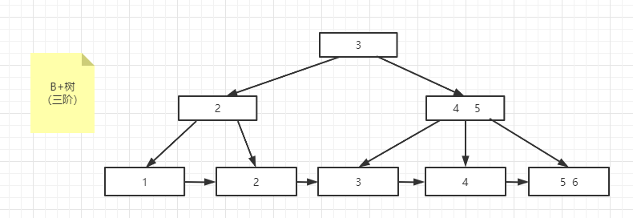
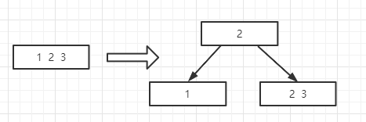

## 性质

M 阶的B+数据

- 每个结点最多存储m-1个元素
- 每个结点最多有m个子结点

- 根结点要么为空，要么为独根，否则至少有2个子结点
- 除根节点外，每个结点至少有m/2个子结点，除不尽则往上取整，7/2=3.5 --> 4
- 叶子结点的高度一致
- 只有叶子结点才存储数据
- 叶子结点之间通过指针相连，提高区间的访问性能

## 图示

## 构建过程

- 自下往上构建
- 先分裂（m/2）再插入

