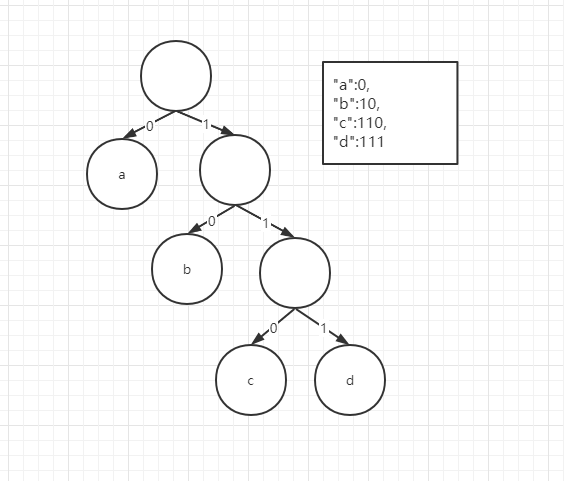

## 问题

1. 给定一串字符串：`abcd`，如何压缩？

我们知道每个字节在计算机中占`8bit`，

假使我们定义二进制 `00` 表示 `a`， `01` 表示`b`  ， `10` 表示`c`  ， `11` 表示`d`  

那么`abcd`转为二进制后就变成了`00011011`，看，原本占`4*8=32bit`的一串字符串，现在只占`8bit`了，是不是压缩了4倍，nice!

2. 给定一串字符串：`aaaaaabcd`，如何压缩？

如果我们再用上面的做法，就变成了`00000000000000011011`，我们发现前面有一大串`0`,那么我们有没有更好的办法进行优化呢？

比如定义a的二进制位`0`,咦，好像又缩短了一些，但是我们碰到`001`这样的应该怎么解码呢？首先来了个`0`解码为`a`，再来个`0`，解码为`a`，然后是`1`，我们发现没有对应的码值，解码失败了。这是为什么呢？

这里引出一个前缀的问题，这里明显`a`的二进制位是`b`的前缀，如果想保证解码成功，就必须保证没有前缀的情况发生，不然就会出现上面的问题。

说了那么多，现在我们正式看看什么是哈夫曼树吧~

## 定义

给定N个权值作为N个叶子结点，构造一棵二叉树，若该树的带权路径长度达到最小，称这样的二叉树为最优二叉树，也称为哈夫曼树(Huffman Tree)。哈夫曼树是带权路径长度最短的树，权值较大的结点离根较近。

那么这个哈夫曼树和压缩又有什么关系呢？

二叉树：二叉，这时候你要想到二进制，二叉分左右嘛。左节点的边设置为0，右节点的边设置为1

## 哈夫曼编码

在上图的最优二叉树中我们给每一条边加上一个权值，指向左子节点的边我们标记为0，指向右子节点的边标记为1，那从根节点

到叶节点的路径就是我们说的哈夫曼编码；




## 构建过程

核心思想：贪心算法：利用局部最优推出全局最优，把频率出现多的用短码表示，频率出现小的就用长一点。而且，任何一个字符的编码都不是另一个的前缀，在解压缩的时候，我们每次会读取尽可能长的可解压的二进制串，所以在解压缩的时候也不会产生歧义。

具体实现思路：
1.每次取数值最小的两个节点，将之组成为一颗子树。
2.移除原来的两个点
3.然后将组成的子树放入原来的序列中
4.重复执行1 2 3 直到只剩最后一个点


## 代码实现

```java
package com.algorithm.tree;


import java.util.ArrayList;
import java.util.HashMap;
import java.util.List;
import java.util.Map;
import java.util.PriorityQueue;

public class HFMTree {

    private final PriorityQueue<Node> priorityQueue;
    private final List<Node> nodeList;
    private Node root;

    public HFMTree(Map<Character, Integer> dictionary) {
        priorityQueue = new PriorityQueue<>(dictionary.size());
        nodeList = new ArrayList<>(dictionary.size());
        dictionary.forEach((chars, weight) -> {
            Node node = new Node(chars.toString(), weight);
            priorityQueue.add(node);
            nodeList.add(node);
        });
    }

    public void encode() {
        nodeList.forEach(node -> {
            String chars = node.chars;
            String code = "";
            do {
                if (node.parent.left == node) {
                    code = "0" + code;
                }else
                    code = "1" + code;
                node = node.parent;
            }while (node.parent != null);
            System.out.println(chars + ":" + code);
        });
    }

    public void create() {
        int length = priorityQueue.size();
        for (int i = 0; i < length - 1; i++) {
            Node node1 = priorityQueue.poll();
            Node node2 = priorityQueue.poll();
            Node parent = new Node(node1.chars + node2.chars, node1.weight + node2.weight);
            parent.left = node1;
            parent.right = node2;
            node1.parent = parent;
            node2.parent = parent;
            priorityQueue.add(parent);
        }
        root = priorityQueue.poll();
    }


    private static class Node implements Comparable<Node> {
        Node left;
        Node right;
        Node parent;
        int weight;
        String chars;

        public Node(String chars, int weight) {
            this.chars = chars;
            this.weight = weight;
        }

        @Override
        public int compareTo(Node o) {
            return this.weight - o.weight;
        }
    }

    public static void main(String[] args) {
        //a:7 b:10 c:3 d:20 e:6 f:15 g:22
        Map<Character, Integer> dictionary = new HashMap<>();
        dictionary.put('a', 7);
        dictionary.put('b', 10);
        dictionary.put('c', 3);
        dictionary.put('d', 20);
        dictionary.put('e', 6);
        dictionary.put('f', 15);
        dictionary.put('g', 22);
        HFMTree hfmTree = new HFMTree(dictionary);
        hfmTree.create();
        hfmTree.encode();
    }
}
```

