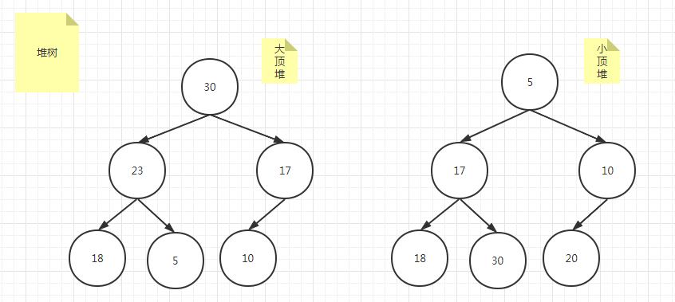
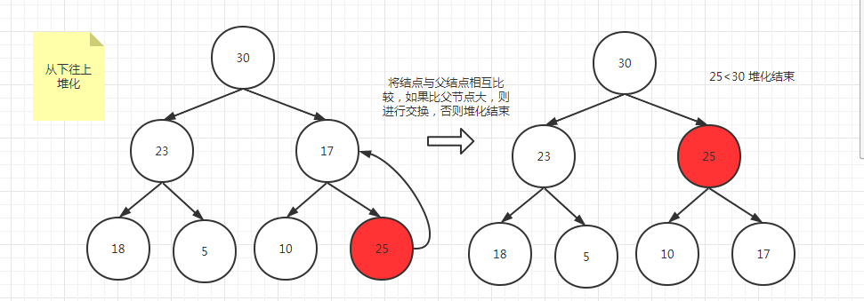
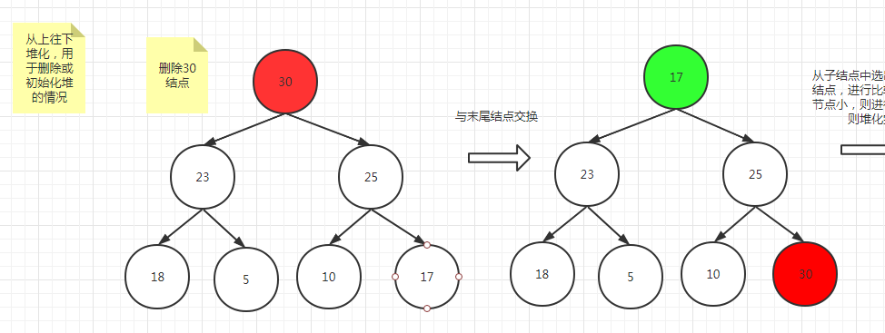
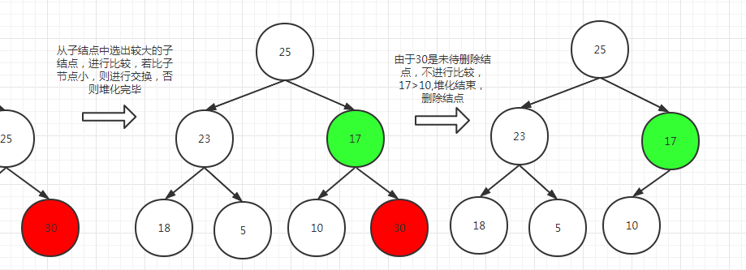
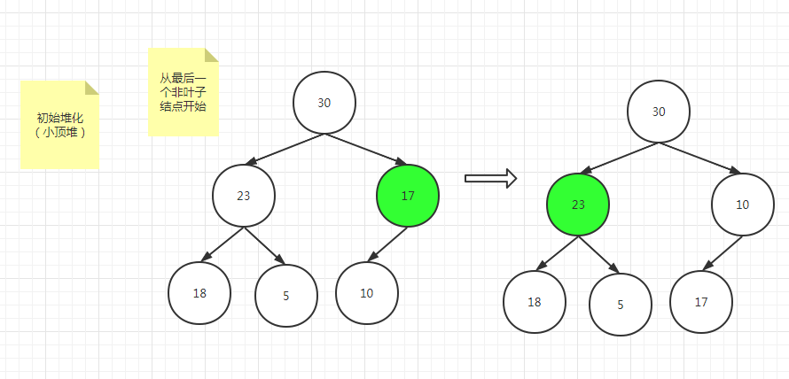
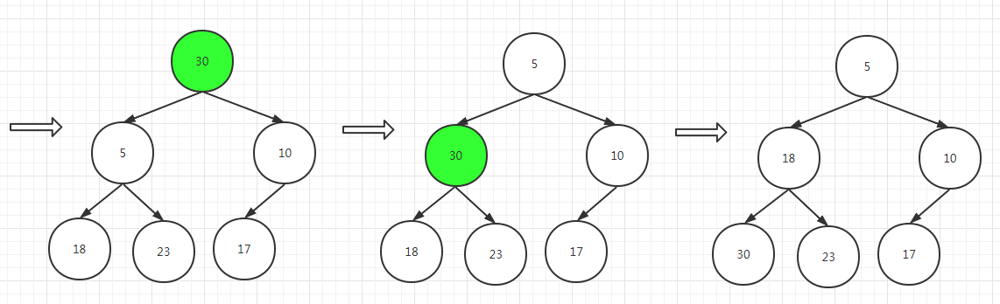

## 定义

- 是一颗完全二叉树
- 每一个结点都大于等于它的子结点（大顶堆），或者小于等于它的子结点（小顶堆）

## 图解



## 堆的插入过程

- 从下往上
- 从上往下

其插入的过程就叫做堆化



## 堆的删除过程





## 初始化堆的过程





## 代码实现

```java
public class HeapTree {

    private int[] arr;

    public HeapTree() {
    }

    public HeapTree(int capacity) {
        arr = new int[capacity];
    }

    /**
     * 堆化方法
     *
     * @param start {@code int} 化堆结点
     * @param end   {@code int} 化堆结束点
     */
    public void heapIndex(int start, int end) {
        int parent = start;
        while (parent * 2 + 1 < end) {
            int son = parent * 2 + 1;
            if (son + 1 < end && arr[son + 1] < arr[son]) {
                son = son + 1;
            }
            if (arr[son] < arr[parent]) {
                int temp = arr[son];
                arr[son] = arr[parent];
                arr[parent] = temp;
            }
            parent = son;
        }
    }

    /**
     * 排序
     */
    public void sort() {
        for (int i = arr.length - 1; i > 0; i--) {
            int temp = arr[0];
            arr[0] = arr[i];
            arr[i] = temp;
            heapIndex(0, i);
        }
    }

    /**
     * 创建堆
     *
     * @param arr {@code int[]} 初始堆
     */
    public void createHeap(int[] arr) {
        this.arr = arr;
        int len = arr.length;
        for (int i = len / 2 - 1; i >= 0; i--) {
            heapIndex(i, len);
        }
    }

    /**
     * top K 问题
     *
     * @param number
     */
    public void topK(int number) {
        if (number < arr[0]) {
            return;
        }
        arr[0] = number;
        heapIndex(0, arr.length);
    }

    public static void main(String[] args) {
        int[] arr = {30, 23, 17, 18, 5, 10};
        HeapTree heapTree = new HeapTree();
        heapTree.createHeap(arr);
        heapTree.sort();
        System.out.println(Arrays.toString(arr));
    }

}
```

## TOP K 问题

给你1亿个的数字（整数，1~2^32-1），求出前10大的数字，还可动态添加新数字。

```java
public class TopKOfNumber {

    public static void main(String[] args) {
        HeapTree heapTree = new HeapTree(10);
        long startTime = System.currentTimeMillis();
        final Random random = new Random();
        int[] arr = new int[10];
        //初始化堆
        for (int i = 0; i < 10; i++) {
            arr[i] = Math.abs(random.nextInt());
        }
        heapTree.createHeap(arr);
        for (int i = 0; i < 100000000; i++) {
            int number = random.nextInt();
            heapTree.topK(number);
        }
        heapTree.topK(Integer.MAX_VALUE);
        System.out.println(Arrays.toString(arr));
        System.out.println("共花费时间: " + (System.currentTimeMillis() - startTime) + "ms");
    }
}
```

